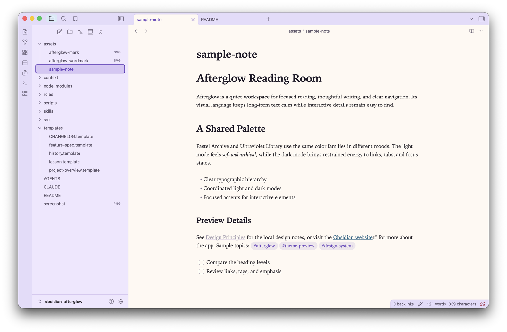
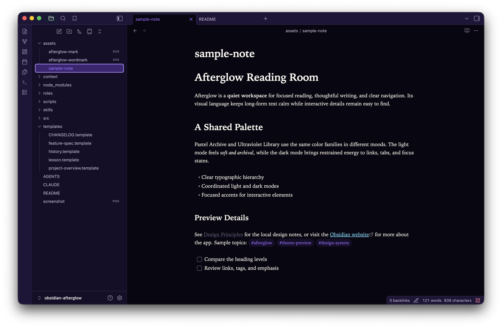

*Afterglow — an Obsidian theme in two coordinated modes: Pastel Archive and Ultraviolet Library*

## What Afterglow is

Afterglow is an in-development Obsidian theme for long reading and writing
sessions. Its light and dark modes share one semantic token system, so switching
the base color scheme changes the palette without changing the theme's
typography, spacing, borders, or component shapes.

## Light and dark previews

### Pastel Archive — light



### Ultraviolet Library — dark



Both images show the same purpose-written [sample note](assets/sample-note.md),
at the same scroll position and with the same panes open.

## Design philosophy

Afterglow treats light and dark as two expressions of one identity rather than
separate themes or a mechanical inversion. Shared semantic roles keep layout
and meaning stable while each mode supplies its own color values. Readability
comes first: body text stays neutral and meets WCAG AA, while color carries
hierarchy, state, and interaction.

## Pastel Archive

Pastel Archive is the light expression: an ivory reading canvas with violet-pale
surfaces and restrained pastel accents. It uses the same five hue families as
Ultraviolet Library — violet, sky, mint, amber, and blush — and every light
family sits within 5° of its dark counterpart. Deeper values from those families
carry text so the soft palette never becomes low-contrast body copy.

## Ultraviolet Library

Ultraviolet Library is the dark expression: a black-violet foundation,
aubergine surfaces, ivory text, and focused ultraviolet and sky accents. It uses
the same five hue families as Pastel Archive, with every dark family within 5°
of its light counterpart. Glow is restrained to interactive emphasis such as
links and focus, never paragraph text.

## Install

Afterglow currently supports manual installation:

1. Download or clone this repository.
2. Create a directory named exactly `Afterglow` inside your vault at
   `.obsidian/themes/Afterglow`.
3. Copy `manifest.json` and `theme.css` from the repository root into that
   directory.
4. In Obsidian, open **Settings → Appearance → Themes** and select
   **Afterglow**.
5. Switch **Base color scheme** between Light and Dark to use Pastel Archive or
   Ultraviolet Library.

For local development, symlink the repository instead of copying generated
files:

```sh
ln -s /absolute/path/to/obsidian-afterglow /path/to/vault/.obsidian/themes/Afterglow
```

Run `npm run build` after changing `src/`; Obsidian reads the regenerated
`theme.css` through the link.

## Status

Afterglow is **not** in the Obsidian community directory, has **no tagged
release**, and is installed manually from this repository. The shared token
foundation, both coordinated modes, automated foundation checks, brand assets,
and real Obsidian previews are in place. Dedicated per-surface refinement is
still pending.

## Roadmap

The remaining work is unstarted:

- refine properties, backlinks, search, graph, callouts, tables, code, command
  palette, modals, and settings;
- complete mobile-specific refinement and visual review;
- prepare public distribution after the supported surfaces and documentation
  are complete.

## Development

Development requires Node.js 18 or newer. Tooling is development-only; no
JavaScript or dependency ships with the theme.

```sh
npm ci
npm run build
npm test
npm run lint
```

Author CSS in `src/`. The build concatenates the modules in numeric order into
the committed `theme.css`; never edit that generated file by hand.

| Module | Responsibility |
| --- | --- |
| `01-shared.css` | Shared typography, spacing, shapes, motion values, and runtime identity |
| `02-palette.css` | Raw mode-specific palette values |
| `03-roles.css` | Semantic roles defined for both modes |
| `04-obsidian.css` | Semantic roles mapped to Obsidian variables |
| `05-motion.css` | Reduced-motion behavior |

To confirm Afterglow is loaded, select it in Obsidian and run this in the
developer console:

```js
getComputedStyle(document.body).getPropertyValue('--ag-theme').trim()
```

The result is `afterglow`.

## Checks

`npm test` currently runs eleven repository checks followed by twenty negative
cases that deliberately break each contract and prove the responsible check can
fail.

| Check | Verifies |
| --- | --- |
| `required-files` | Required shipping files exist and `screenshot.png` is 512×288 |
| `screenshot-content` | The listing screenshot clears the flat-placeholder content threshold |
| `docs-assets` | README-local paths, expected documentation assets, safe SVGs, and optimized matching previews |
| `manifest` | Theme metadata is complete and uses strict semantic versioning |
| `build-sync` | Committed `theme.css` matches the output from `src/` |
| `css-validity` | Source and generated stylesheets parse and satisfy stylelint |
| `css-policy` | No remote assets, `!important`, or `:root`; the runtime marker is present |
| `token-parity` | Both modes define the same semantic roles |
| `contrast` | Important text/background pairs meet WCAG AA |
| `surface-separation` | Adjacent grounds remain distinguishable |
| `hue-coordination` | Corresponding light and dark roles stay in the intended hue families |

Automated checks verify the shipped artifact and its contracts. Real-vault
review remains the evidence for visual claims.

## Design rules

- No `!important`; users' own CSS snippets retain control.
- No remote assets, network calls, or bundled fonts.
- Override Obsidian variables under `body`, `.theme-light`, or `.theme-dark`,
  never `:root`.
- Keep palette values, semantic roles, and Obsidian mappings in separate layers.
- Define every semantic role in both modes.
- Keep body text neutral and WCAG AA; use color for hierarchy, semantics, and
  interaction.
- Honor `prefers-reduced-motion`.

## Credits

Afterglow is designed and maintained by Ricardo Lamadrid.

## License

[MIT](LICENSE)
